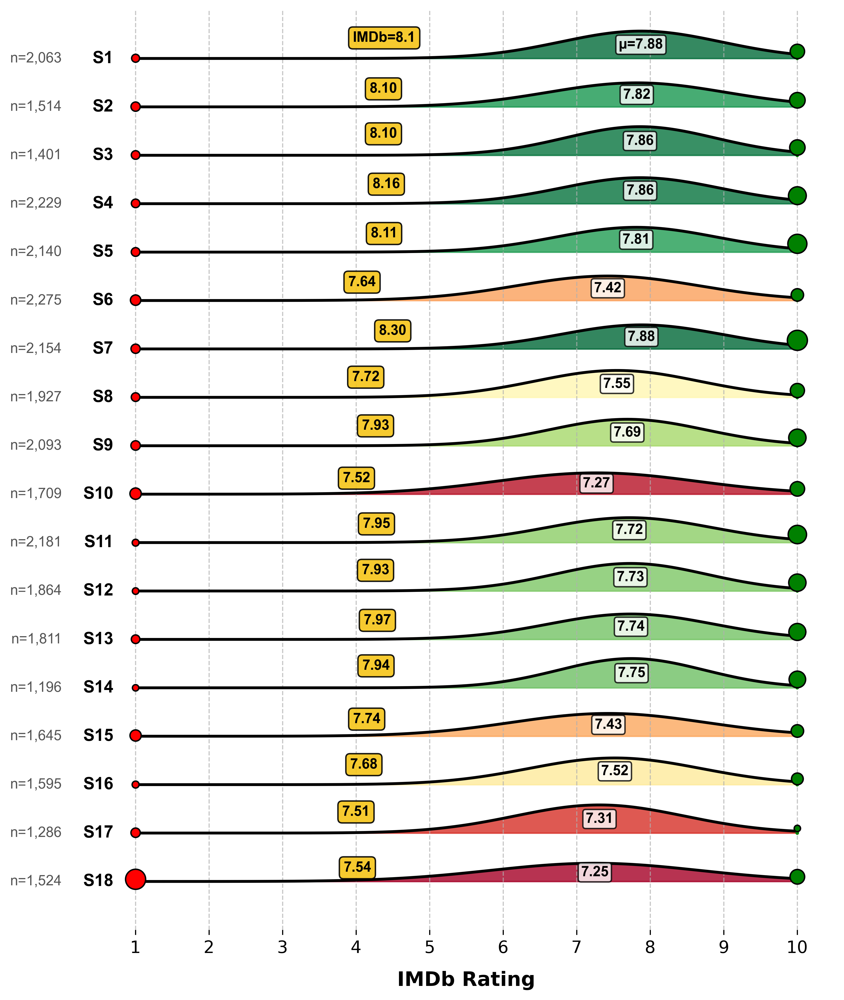
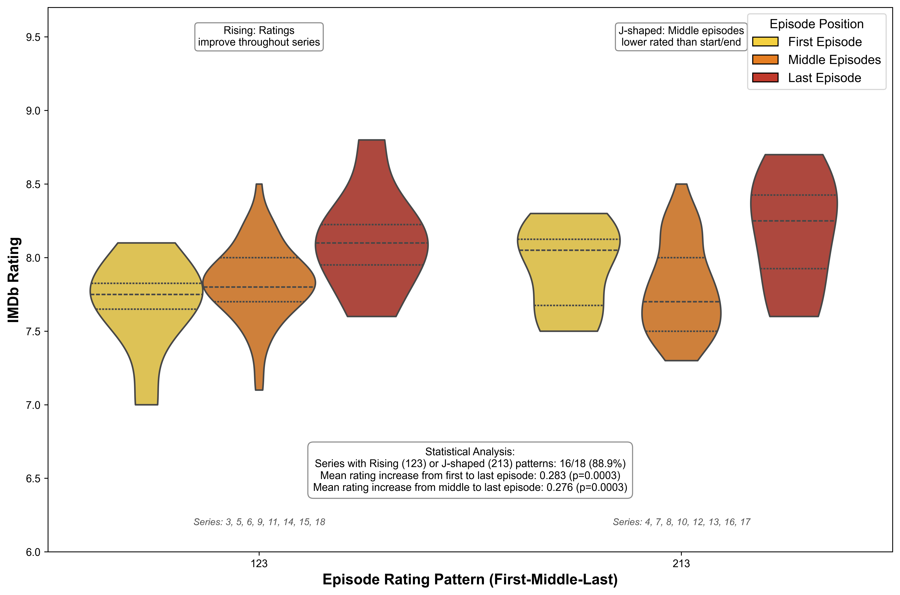
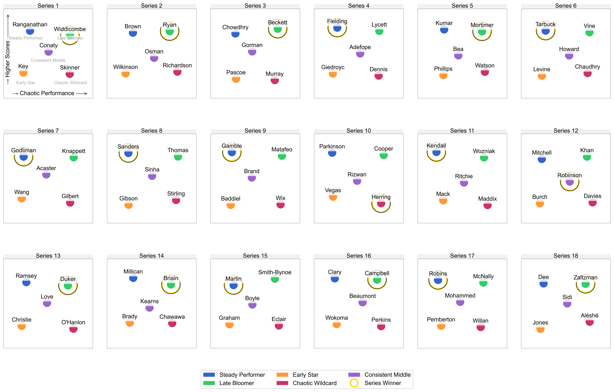
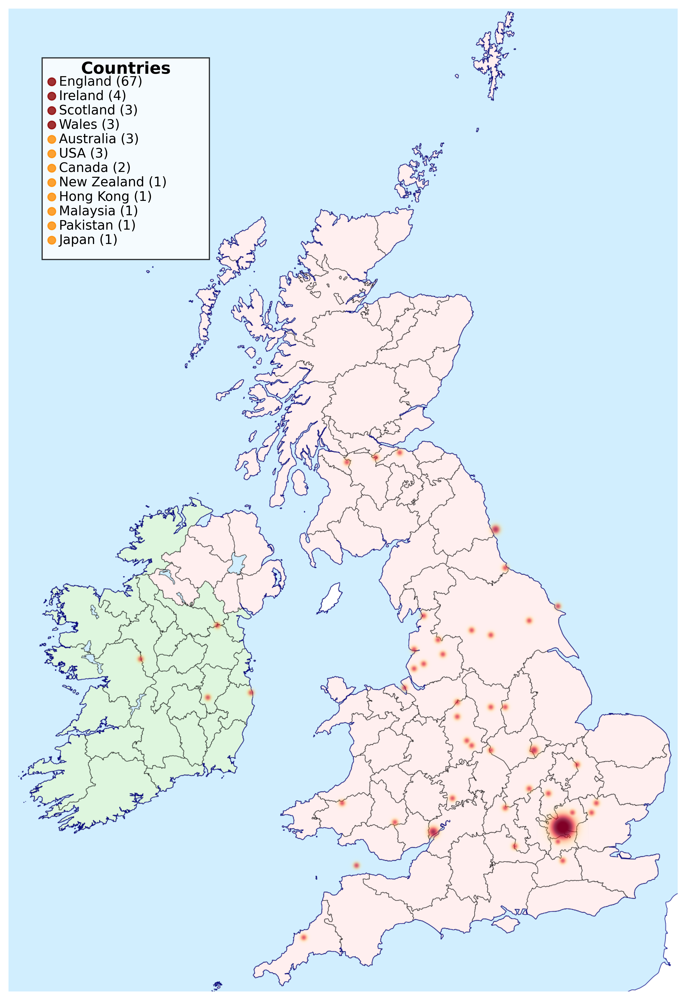

# Quantifying Audience Engagement in Hybrid Entertainment Through Analysis of 18 Series of Taskmaster UK

This repository contains the complete codebase for a comprehensive quantitative analysis of the British comedy panel show Taskmaster. The project explores how competitive mechanics, performer characteristics, and emotional tone interact to shape viewer engagement in hybrid entertainment formats that blend structured gameplay with unscripted humor.

>  **For complete research methodology and findings, see the published paper and [FiguresGuide.MD](FiguresGuide.MD)**

## Project Overview

This analysis leverages multiple datasets spanning 154 episodes, 917 tasks, and over 32,600 IMDb viewer ratings to provide empirical insights into what drives audience engagement in hybrid entertainment. The study employs advanced statistical techniques including mixture model fitting for rating distributions, principal component analysis, performance archetype clustering, and sentiment analysis to understand how Taskmaster balances structure with comedic unpredictability.

**Key Finding**: Competitive scoring mechanics provide structural framework, but audience engagement correlates primarily with performer characteristics (age, experience) and emotional content rather than scoring dynamics.

> **For detailed analysis framework and module documentation, see [FiguresGuide.MD](FiguresGuide.MD)**

## Key Visualizations

### IMDb Rating Distributions Across 18 Series


The figure above shows the tri-modal nature of IMDb ratings, with distinct peaks at ratings 1, 10, and a Gaussian distribution for intermediate ratings. This mixture model approach reduced prediction error by 48.1% compared to traditional single-distribution models.

### Episode Rating Trajectories Within Series


This visualization reveals that 16 of 18 series follow Rising or J-shaped rating patterns, with final episodes averaging +0.28 points higher than premieres. The consistent upward trajectory suggests viewers develop stronger engagement as series progress.

### Additional Key Figures

| Analysis | Figure | Description |
|----------|--------|-------------|
| **Rating Distributions** |  | Tri-modal IMDb rating patterns across 18 series |
| **Episode Trajectories** |  | Within-series rating evolution patterns |
| **Performance Archetypes** |  | Five consistent performer types across all series |
| **Geographic Origins** |  | Contestant birthplace distribution analysis |

> **Note**: All figures are available in both PNG and PDF formats in their respective analysis directories.

## Directory Structure

```
taskmaster-paper/
├── config/                                    # Configuration and utilities
│   ├── plot_config.yaml                      # Visual settings for all plots
│   └── plot_utils.py                         # Shared plotting utilities
├── data/
│   ├── raw/                                  # Original datasets with documentation
│   │   ├── DATA_SOURCES_AND_METHODOLOGY.md  # Comprehensive data documentation
│   │   ├── sentiment_analysis.py            # Reference script for sentiment extraction
│   │   ├── contestants.csv                  # Contestant demographics and performance
│   │   ├── imdb_ratings.csv                 # Official IMDb episode ratings
│   │   ├── taskmaster_histograms_corrected.csv # IMDb vote distributions (1-10)
│   │   ├── sentiment.csv                    # Episode-level sentiment analysis
│   │   ├── _OL_tasks.csv                    # GPT-4o classified task types
│   │   ├── taskmaster_uk_episodes.csv       # Episode metadata
│   │   ├── taskmaster_UK_tasks.csv          # Task metadata and classifications
│   │   ├── scores.csv                       # Individual task scores
│   │   ├── long_task_scores.csv             # Task scores in long format
│   │   └── Cont_lon_lat.tsv                 # Contestant geographic coordinates
│   ├── processed/                           # Processed data organized by analysis
│   └── taskmaster_data_documentation.md     # Data processing overview
├── figures/                                 # Analysis modules (one per research question)
│   ├── series_ratings_analysis/             # IMDb rating distributions & mixture models
│   ├── episode_rating_trajectories/         # Within-series rating patterns
│   ├── task_characteristics_analysis/       # Task typology and demand analysis
│   ├── contestant_geographic_origins/       # Geographic distribution analysis
│   ├── contestant_performance_archetypes/   # Performance-based clustering
│   ├── sentiment_trends_analysis/           # Comedic sentiment patterns
│   ├── predictive_modeling_analysis/        # Episode success prediction models
│   ├── scoring_pattern_geometry/            # Task scoring system analysis
│   ├── task_skill_profiles/                 # Task-skill requirement mapping
│   └── individual_series_analysis/          # Series-specific deep dives
├── FiguresGuide.MD                         # Figure generation and interpretation guide
├── figures_workflow.md                     # Implementation workflow standards
├── generate_all_figures.py                # Master script for all analyses
└── requirements.txt                        # Python dependencies
```

> **For comprehensive data statistics and insights, see [data/taskmaster_data_documentation.md](data/taskmaster_data_documentation.md)**

## Key Research Findings

### Scoring Dynamics vs. Audience Engagement
- **Low-dimensional scoring analysis**: Mean (μ) and variance (σ²) of task score distributions showed no significant associations with IMDb ratings (μ: r = -0.012, p = 0.890; σ²: r = -0.118, p = 0.179)
- **Scoring pattern usage**: Only 38.9% (98/252) of mathematically possible five-contestant scoring distributions occur in practice, clustering around moderate generosity and spread
- **Conclusion**: Competitive mechanics provide framework but do not drive audience satisfaction

### Performer Characteristics Drive Engagement
- **Contestant age**: Strongest predictor of episode ratings (39.5% ± 2.1% feature importance in Random Forest models)
- **Experience matters**: More experienced performers consistently correlate with higher ratings (16.2% feature importance)
- **Professional background**: Higher proportion of comedians vs. actors correlates positively with ratings (6.5% feature importance)
- **Gender balance**: Modest positive correlation with balanced gender distributions (5.2% feature importance)

### Temporal and Emotional Patterns
- **Episode trajectories**: 16 of 18 series follow Rising or J-shaped rating patterns, with final episodes averaging +0.28 points higher than premieres (p < 0.001)
- **Sentiment evolution**: Significant increase in awkwardness over time (β = 0.0122, adjusted p = 0.0027), while other emotional tones remain stable
- **Performance archetypes**: Five consistent performance patterns identified across all series (Steady Performer, Late Bloomer, Early Star, Chaotic Wildcard, Consistent Middle)

### Statistical Methodology Innovations
- **Mixture model performance**: Tri-peak model (δ(1) + δ(10) + Gaussian) reduced mean absolute error by 48.1% vs. single Gaussian
- **Cross-validation approach**: Series-level splits prevent overfitting to seasonal patterns
- **Low-dimensional representation**: Avoids multicollinearity issues common in entertainment research

## Advanced Statistical Methods

### Mixture Model Fitting for Rating Distributions
IMDb rating distributions modeled as weighted combinations of:
- Delta functions at ratings 1 & 10 (polarized responses)
- Gaussian distribution for ratings 2-9 (consensus responses)
- Quantitative validation shows superior fit vs. naive Gaussian models

### Principal Component Analysis
Series-level reception quality profiling using four orthogonal dimensions:
- Percentage of 1-star ratings (polarization)
- Percentage of 10-star ratings (enthusiasm)
- Mean of Gaussian component (consensus quality)
- Standard deviation (rating spread)

### Performance Archetype Clustering
Contestant classification using 15-dimensional feature vectors:
- Score trajectory patterns and ranking evolution
- Volatility, consistency, and comeback metrics
- Greedy assignment ensuring one representative per archetype per series

### Sentiment Analysis Pipeline
GPT-4o powered extraction across seven emotional dimensions:
- 95.3% accuracy vs. 66-71% for classical ML and 37.2% for lexicon methods
- Episode-level aggregation from sentence-level annotations
- Temporal trend analysis with False Discovery Rate correction

## Setup and Installation

1. **Create Python Environment** (Python 3.8+ recommended):
   ```bash
   python -m venv venv
   source venv/bin/activate  # On Windows: venv\Scripts\activate
   ```

2. **Install Dependencies**:
   ```bash
   pip install -r requirements.txt
   ```

3. **Data Preparation**: Raw data files are included in `data/raw/` with comprehensive documentation

## Usage

### Generate All Analyses
```bash
python generate_all_figures.py
```

### Generate Specific Analysis Module
```bash
python generate_all_figures.py --module series_ratings_analysis
```

### Process Data Only (No Visualization)
```bash
python generate_all_figures.py --process-only
```

### Generate Plots Only (Skip Data Processing)
```bash
python generate_all_figures.py --plot-only
```

### List All Available Modules
```bash
python generate_all_figures.py --list
```

## Analysis Modules

The project includes 10 comprehensive analysis modules corresponding to the paper's main findings:

1. **Series Ratings Analysis**: Mixture model fitting and tri-peak distribution analysis
2. **Episode Rating Trajectories**: Within-series rating pattern identification (Rising, J-shaped, etc.)
3. **Task Characteristics Analysis**: Task typology stability across 18 series
4. **Geographic Origins**: Contestant birthplace distribution and cultural analysis
5. **Performance Archetypes**: Five-archetype clustering with consistent representation
6. **Sentiment Trends**: Temporal evolution of comedic emotional tone
7. **Predictive Modeling**: Random Forest models with series-level cross-validation
8. **Scoring Pattern Geometry**: Mathematical analysis of used vs. unused scoring configurations
9. **Task Skill Profiles**: GPT-4o assisted task difficulty profiling (exploratory only)
10. **Individual Series Analysis**: Series-specific performance trajectory visualization

> **For detailed module documentation and implementation status, see [FiguresGuide.MD](FiguresGuide.MD)**

## Data Sources and Reliability Assessment

### High Reliability (Statistical Analysis)
- **IMDb Data**: Official ratings and vote distributions with >99% correlation validation between histograms and published scores
- **Episode Metadata**: Verified information from taskmaster.info community database
- **Contestant Demographics**: Manually verified from multiple public sources

### Medium Reliability (Exploratory Analysis)
- **Geographic Data**: Official birthplace coordinates with manual disambiguation
- **Task Classifications**: Human-annotated with consensus verification

### Exploratory Only (No Statistical Conclusions)
- **GPT-4o Task Skill Profiles**: Used for visualization and pattern identification only
- **Sentiment Analysis**: GPT-4o extraction validated against benchmarks but not used for causal inference

> **For complete data reliability assessment and collection methodology, see [data/raw/DATA_SOURCES_AND_METHODOLOGY.md](data/raw/DATA_SOURCES_AND_METHODOLOGY.md)**

## Key Methodological Innovations

### Addressing Multicollinearity in Entertainment Research
Traditional studies often use multiple overlapping metrics (volatility, variance, spread) that can inflate false positives. This study adopts a minimal two-dimensional representation (μ, σ²) that captures >90% of scoring pattern variation while avoiding intercorrelation issues.

### Series-Level Cross-Validation
Machine learning models use series-level splits rather than random episode splits, preventing overfitting to seasonal tone or cast-specific patterns and ensuring generalizability across different seasons.

### Mixture Modeling for Audience Polarization
Recognition that entertainment ratings often exhibit tri-modal rather than unimodal distributions, with distinct subpopulations of highly positive, highly negative, and moderate viewers.

## Academic Context and Contributions

This work contributes to the quantitative analysis of hybrid entertainment formats by:

1. **Empirical validation** of theories about what drives engagement in comedy-competition hybrids
2. **Methodological framework** for analyzing unscripted entertainment with structured elements
3. **Statistical techniques** for handling polarized audience responses and temporal patterns
4. **Reproducible pipeline** for similar analyses of other panel shows or hybrid formats

The findings support theories that hybrid entertainment derives appeal from performer charisma and emotional tone rather than competitive tension alone, positioning the competitive framework as an enabling structure rather than the primary value driver.

## Citation

### Repository Citation
```
Silver, D. (2024). Quantifying Audience Engagement in Hybrid Entertainment Through Analysis 
of 18 Series of Taskmaster UK. GitHub repository: 
https://github.com/silverdavi/taskmaster-paper
```

### Data and Code Availability
All data, analysis code, and reproducible pipeline are publicly available. The repository provides complete reproducibility with:
- Raw datasets with comprehensive documentation and reliability assessments
- 10 modular analysis components with statistical validation
- Automated figure generation pipeline with consistent styling
- Mixture model implementations with goodness-of-fit analysis
- Cross-validated machine learning models with feature importance analysis

## Contributing

When contributing to this analysis:

1. Follow the established modular structure in `figures/`
2. Use consistent styling from `config/plot_config.yaml`
3. Document all statistical methods and assumptions
4. Include goodness-of-fit metrics for model validation
5. Update relevant documentation files
6. Use series-level cross-validation for temporal data

> **For detailed workflow standards and quality assurance, see [figures_workflow.md](figures_workflow.md)**

## License

This project is for academic research purposes. Raw data sources are acknowledged in `data/raw/DATA_SOURCES_AND_METHODOLOGY.md`. The analysis code is available under standard academic use terms.

---

## Documentation Index

- **[FiguresGuide.MD](FiguresGuide.MD)**: Analysis module documentation and implementation guide
- **[figures_workflow.md](figures_workflow.md)**: Implementation workflow and quality standards
- **[data/taskmaster_data_documentation.md](data/taskmaster_data_documentation.md)**: Comprehensive data statistics and insights
- **[data/raw/DATA_SOURCES_AND_METHODOLOGY.md](data/raw/DATA_SOURCES_AND_METHODOLOGY.md)**: Data collection methodology and reliability assessment
- **[ISSUES_AND_ROADMAP.md](ISSUES_AND_ROADMAP.md)**: Issues tracker and development roadmap